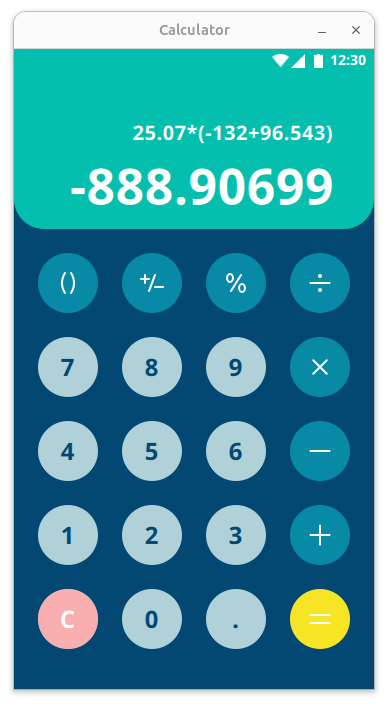
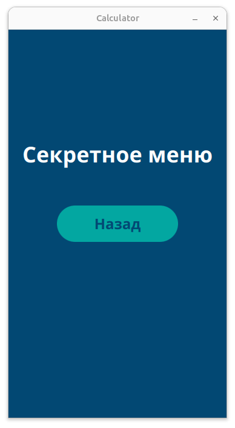
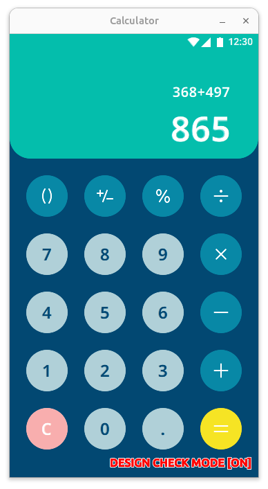

#  CalcApp (Qt/QML)

Десктопное приложение калькулятора на QML и C++17.

## Интерфейс

<div align="center">
  
  
  
</div>

## Базовый функционал и особенности
- Собственно функционал как и у базового калькулятора:
    - Ввод чисел, простых арифметических уравнений
    - Расчет результата с учетом приоритетов скобок и математических операций
    - Работа с числами до 25 знаков(по сути вышло куда больше возможных за счет **Boost.Multiprecision**)
    - Обработка ошибок: деление на ноль, неправильная работа со скобками
- Интерфейс сверстан на QML точь в точь относительно макета: с жесткой фиксацией размеров окна (`360x640`) и всех внутренних элементов (кнопки, отступы, шрифты)
- GUI в части кнопок и иконок сверстан на svg-ассетах с фигмы, через Theme.qml подменяется на новые при необходимости
- Скрытое меню:
  - Активация: Долгое нажатие (4 секунды) на кнопку **"="**
  - Ввод кода: В течение 5 секунд необходимо ввести комбинацию **"123"** на цифровой клавиатуре
  - Результат: Переход на второй экран с надписью «Секретное меню» и кнопкой «Назад»
- Написан на MVVM: правда без чистого M, ибо выносить из ViewModel обработку вычислений в таком небольшом объеме считаю избыточной

## Расширеные возможности
- Захват ввода чисел с клавиатуры через Qt.Key
- Flickable + ScrollBar для реализация прокрутки строк с выражением и результатом вправо при их выходе за пределы просмотра в фиксированном GUI
- Обложил unit-тестами движок калькулятора для наглядной демонстрации основных возможных состояний при работе  
- Для сверки верстки с оригинальным макетом по нажатию F1 на окно приложения накладывается полупрозрачный скрин с макета.
## Алгоритмы вычислений

В связи с необходимостью работать с числами до 25 знаков(что по сути выходит за стандартный double) возникла основная сложность какой же тип или надстройку использовать.

Зная что long_double зависит в немалом от того под какое ОС его собрали(а точне от компилятора), было принято решение взять готовую заготовку на работу с большими числами
и в особенности точную работу с большими дробями **Boost.Multiprecision**. В свою очередь остается только правильно распарсить и вычислить итоговое выражение и для этого используется
два классических для калькуляторов метода:

### 1. Алгоритм "Сортировочная станция" (Shunting-yard algorithm)
- [Ссылка на описание алгоритма](https://www.chris-j.co.uk/parsing.php) 
- [И про него же, но на вики](https://en.wikipedia.org/wiki/Shunting_yard_algorithm) 

Используется для преобразования привычной записи (например, `2 + 3 * 4`) в обратную польскую запись (RPN).
- Нужен по сути для правильного парсинга арифметических выражений. Алгоритм  линейно проходит по выражению, используя стек для временного хранения операторов, и выстраивает их в правильном порядке выполнения.
- Он используется в методе `toRPN()` в классе `CalculatorEngine`.

### 2. Обратная польская запись (RPN)

Ну тут, ничего нового, запись, в которой операнды стоят перед знаками операций.

- Выполняется за один проход с использованием стека. Числа кладутся в стек, при встрече оператора из стека достаются нужные операнды, выполняется действие, и результат кладется обратно.
- Она используется в методе `evaluateRPN()`, вместе с типом `BigFloat(Boost.Multiprecision)` для сохранения точности, что важно особенно для дробей

## Потенциальные проблемы/задачи
- Все таки svg это хорошо, но лучше иметь в `Theme.qml` весь список style-guide элементов из figma-макета. Особенно если планируется частая смена стиля UI при дальнейшей разработке.
- Если бы не мысль о том насколько точно будет показываться дробная часть в 20+ символов, то можно было бы обойтись уже встроенным парсером арифметический выражений из QJSEngine, а не писать свое
- В случае если интерфейс не будет жестко фиксируемый, а планирует скалироваться/растягиваться, то явно надо будет рефакторить подход к отступам и размерамы на более динамический.
- В Win11 есть явная проблема с точным отображением шрифтов, а именно letterSpacing относительно макета, на текущий момент еще ищу решение.
## Используемый Стек

- **Язык**: C++17
- **GUI Фреймворк**: Qt 5.15 (QtQuick)
- **Математика**: Boost.Multiprecision (`cpp_dec_float_50`)
- **Тестирование**: GoogleTest
- **Сборка**: CMake
- **ОС**: Ubuntu(Linux), Win11

## Требования

- CMake >= 3.16
- Qt 5(модули: Core, Gui, Quick, QuickControls2)
- Библиотека Boost
- Компилятор с поддержкой C++17
- Было проверено на OC Ubuntu24(Qt 5.15.13 + gcc) и Win11(Qt 5.15.2 + mingw)

## Сборка и запуск

1. Конфигурация и сборка
```bash
mkdir build && cd build
cmake ..
make
```

2. Запуск 
```bash
./CalcApp
```


3. Запуск Тестов
```bash
./СalcAppTests
```
